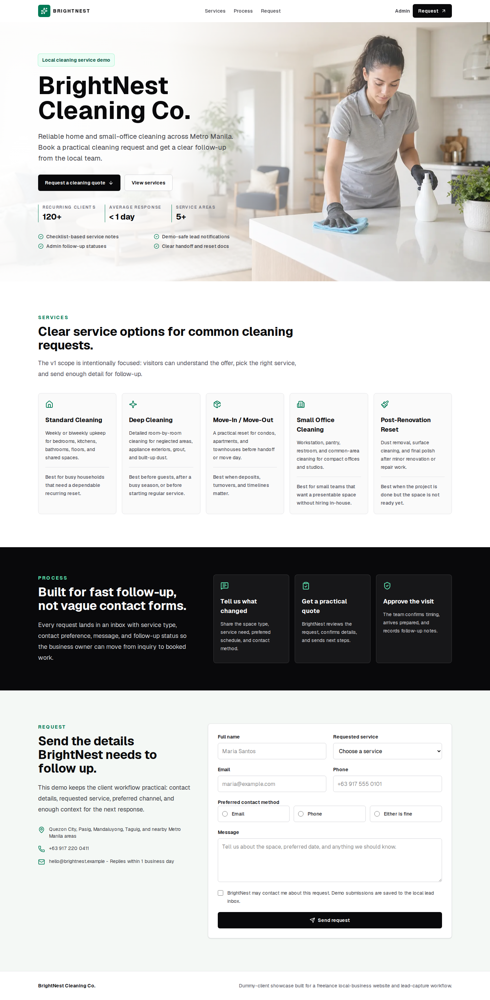
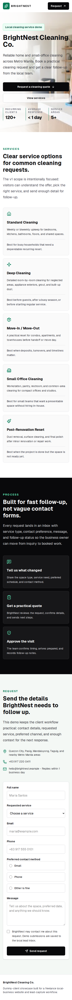
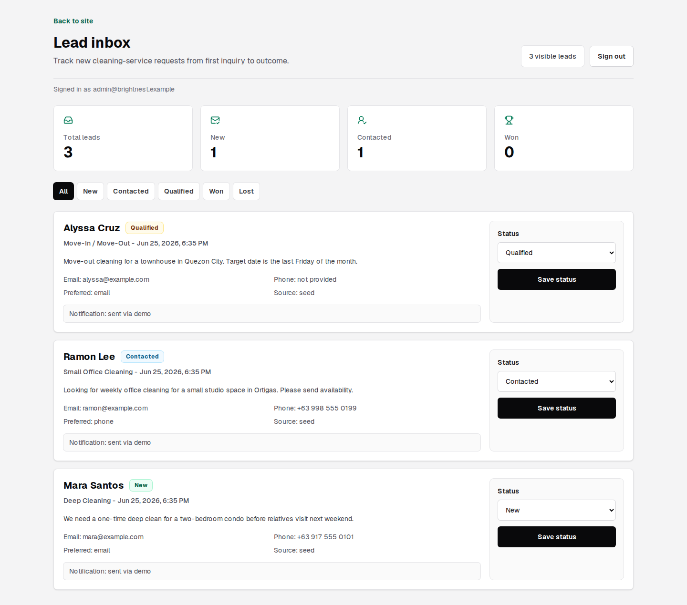

# Business Frontpage + Lead Capture

A production-minded Next.js showcase for a dummy local cleaning-service client.
The app proves a practical freelance workflow: a public business frontpage,
validated lead capture, demo-safe notification outbox, and an admin inbox for
lead follow-up.

## Dummy Client

- **Business:** BrightNest Cleaning Co.
- **Client type:** Local residential and small-office cleaning service
- **Audience:** Busy homeowners, condo renters, small-office managers, and
  move-out clients in Metro Manila
- **Primary goal:** Turn website visitors into qualified cleaning-service leads
  with enough detail for fast follow-up
- **Lead workflow:** public form -> server validation -> database lead ->
  notification outbox -> admin status tracking

## Stack

- Next.js 16 App Router
- React 19 and TypeScript
- Tailwind CSS 4
- Prisma 6 with SQLite for local demo persistence
- Zod validation
- Nodemailer SMTP delivery with demo-safe outbox fallback
- Vitest unit tests
- Playwright browser tests
- GitHub Actions CI
- Docker and Docker Compose for self-hosted development and production-like runs

The source uses a light FSD-style layout:

- `src/app`: Next.js routes and metadata files
- `src/widgets`: assembled page and admin surfaces
- `src/features`: lead capture and admin actions
- `src/entities`: lead domain model, validation, and persistence services
- `src/shared`: config, utilities, security helpers, and database client

## Local Setup

```bash
npm install
cp .env.example .env
npm run db:generate
npm run db:push
npm run db:seed
npm run dev
```

Open `http://localhost:3000`.

The local admin inbox is available at `/admin`. The demo login is:

- Email: `admin@brightnest.example`
- Password: `local-demo-admin`

## Environment

```bash
DATABASE_URL="file:./dev.db"
ADMIN_EMAIL="admin@brightnest.example"
ADMIN_PASSWORD="local-demo-admin"
ADMIN_PASSWORD_HASH="scrypt:..."
SESSION_SECRET="change-this-local-demo-session-secret-32-plus-characters"
LEAD_NOTIFICATION_EMAIL="owner@brightnest.example"
EMAIL_DELIVERY_MODE="demo"
SMTP_HOST=""
SMTP_PORT="587"
SMTP_SECURE="false"
SMTP_USER=""
SMTP_PASSWORD=""
SMTP_FROM="BrightNest Cleaning Co. <hello@brightnest.example>"
NEXT_PUBLIC_SITE_URL="http://localhost:3000"
```

`EMAIL_DELIVERY_MODE=demo` writes a notification record to the outbox and logs a
safe message. Set `EMAIL_DELIVERY_MODE=smtp` and provide SMTP settings for real
email delivery.

## Verification

```bash
npm run lint
npm run typecheck
npm run test
npm run build
```

For browser coverage:

```bash
npm run db:push
npm run db:seed
npm run test:e2e
```

CI runs install, Prisma generation, database setup, lint, typecheck, unit tests,
and production build.

## Selected Launch Path

The selected v1 launch path is a hybrid portfolio demo:

- Public demo URL target: `https://frontpage.demo.reannu.dev`
- Host: home server behind Cloudflare Tunnel
- Runtime: Dockerized Next.js standalone app behind TLS
- Database: SQLite persisted in the Docker volume for the first public demo
- Email mode: `demo`, with SMTP support kept ready for a real sender later
- Self-hosting proof: Docker and Compose stay part of the deliverable

Use `.env.production.example` as the launch environment template and see
`docs/launch-plan.md` for the deployment checklist.

## API

`POST /api/leads` accepts JSON or multipart form data using the same validation
rules as the public form.

Required fields:

- `fullName`
- `requestedService`
- `preferredContactMethod`
- `message`
- `privacyConsent`
- At least one of `email` or `phone`

Supported service IDs:

- `standard-cleaning`
- `deep-cleaning`
- `move-in-out`
- `office-cleaning`
- `post-renovation`

Supported contact methods:

- `email`
- `phone`
- `either`

## Admin Workflow

The admin inbox supports these lead statuses:

- New
- Contacted
- Qualified
- Won
- Lost

This is intentionally simple for v1. It proves the operational loop without
turning the app into a CRM.

## Documentation

- [Dummy-client brief](docs/dummy-client-brief.md)
- [Case-study note](docs/case-study.md)
- [Deployment notes](docs/deployment-notes.md)
- [Launch plan](docs/launch-plan.md)
- [Home server deployment](docs/home-server-deployment.md)
- [Email setup](docs/email-setup.md)
- [Admin authentication](docs/admin-auth.md)
- [Self-hosting with Docker](docs/self-hosting.md)

## Screenshots







## Known Limits

- Admin access is a single-account login backed by an env-stored password hash,
  not a multi-user auth system.
- Email delivery is demo-safe for the selected public dummy-client v1. SMTP is
  supported for a later real-provider launch.
- SQLite is the selected first-demo database for Docker/self-hosting. Move to
  Postgres when managed backups, multiple app instances, or a serverless hosted
  platform matter more than a compact self-hostable demo.
- The in-memory rate limit is suitable for a single demo process, not a
  multi-instance production cluster.
- As of 2026-06-25, `npm audit --omit=dev` reports a moderate advisory in
  Next 16.2.9's bundled PostCSS dependency. Next 16.2.9 is npm's latest stable
  Next release, and npm's force fix would downgrade Next, so track the next
  stable Next patch before public launch.
- Appointment booking and CMS editing are separate future showcases, not v1
  scope.
